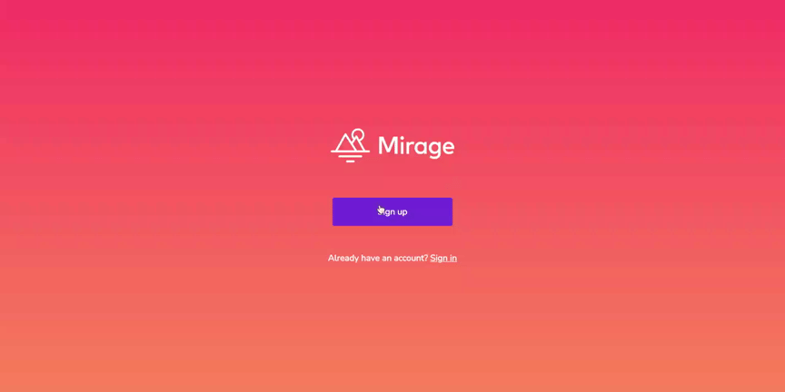
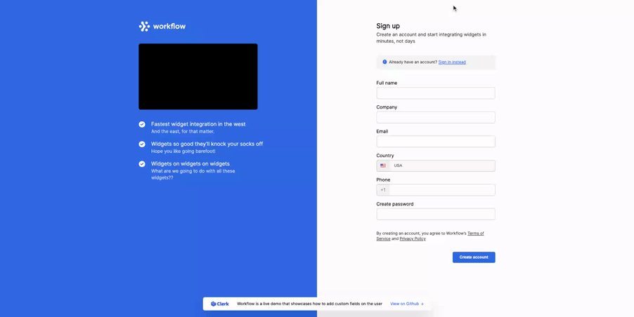

# Clerk Next.js Examples

This repository holds sample code for different types of authentication flows you might need for your application. All built using [Clerk](https://clerk.dev?utm_source=github&utm_medium=starters&utm_campaign=nextjs-examples)!

    
    
    

## Live demo

- Clerk Acme - https://nextjs.acme.clerk.app/
- Clerk Oasis - https://nextjs.oasis.clerk.app/
- Clerk Widget - https://nextjs.widget.clerk.app/

## Examples code

- [Clerk Acme](./examples/acme): _Sign up screen using the Clerk Components._
- [Clerk Oasis](./examples/oasis): _Multi-step authentication form._
- [Clerk Widget](./examples/widget): _Custom user data sign up form._

## Sign up for Clerk

To sign up, go to [https://clerk.dev](https://clerk.dev?utm_source=github&utm_medium=starters&utm_campaign=nextjs-examples), create your account and start building your user authentication!

## Using the examples

Each example is a fully runnable application which you can use either as a starter or a guideline on how you can utilize Clerk based on your requirements. In each example folder, you will find instructions on how to bootstrap the application.

## Having trouble ?

If you find any bug, something is not working as expected or you would like to see if we can support your use case, you can reach out to any of our [support channels](https://clerk.dev/support?utm_source=github&utm_medium=starters&utm_campaign=nextjs-examples), or just open a new issue!
