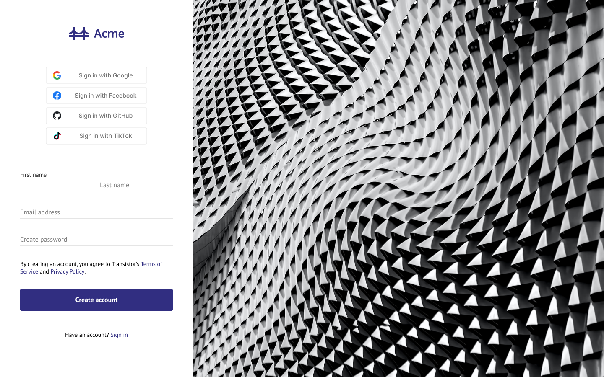
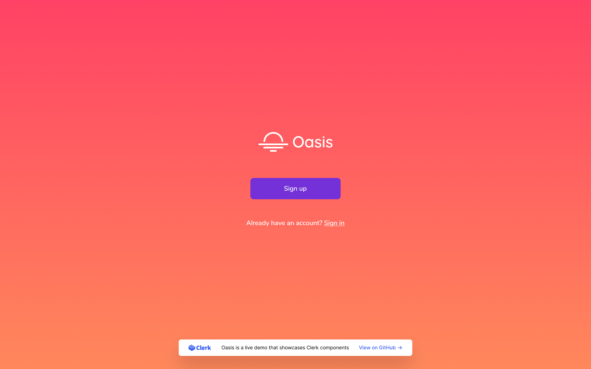
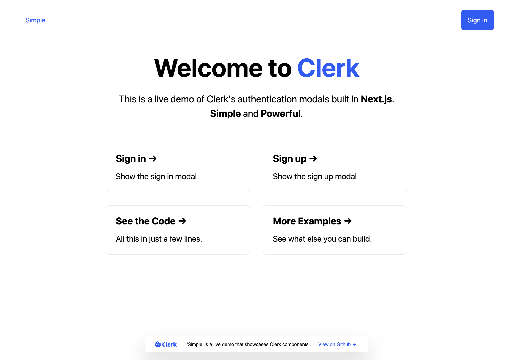
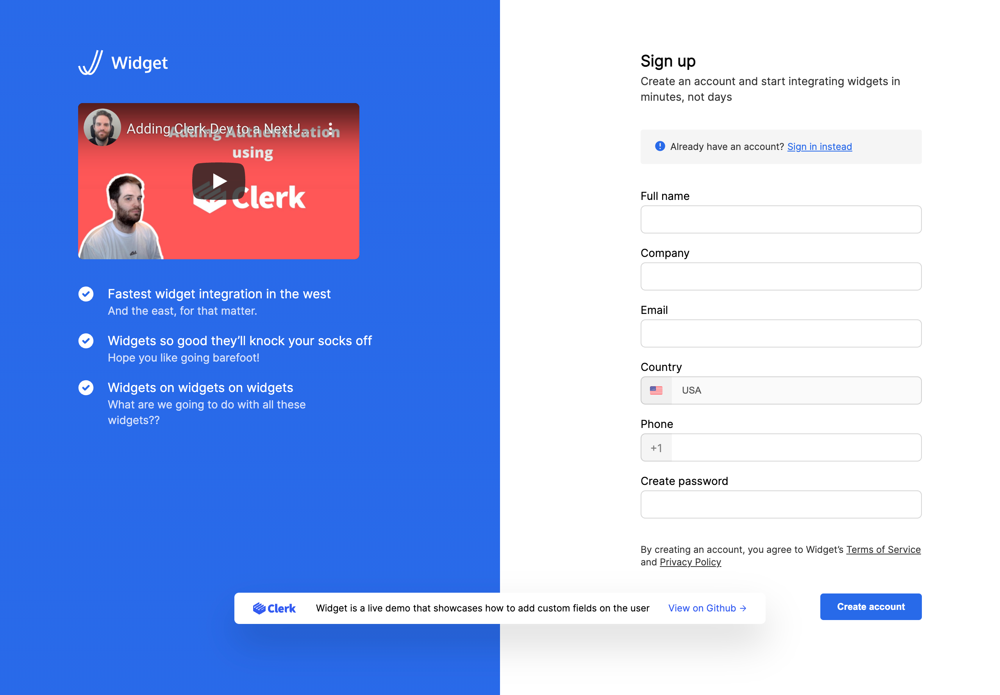

  
   

# Clerk Next.js Examples

---

### Clerk is Hiring!

Would you like to work on Open Source software and help maintain this repository? Apply today https://apply.workable.com/clerk-dev/.

---

This repository holds sample code for different types of authentication flows you might need for your Next.js application. All built using [Clerk](https://clerk.dev?utm_source=github&utm_medium=starters&utm_campaign=nextjs-examples)!

### 1. Acme

Custom sign up screen using the ClerkJS Components.

[Live demo](https://nextjs.acme.clerk.app/)

### 2. Oasis

Custom multi-step authentication form using Clerk hooks.</h5>

[Live demo](https://nextjs.oasis.clerk.app/)

### 3. Simple

The simplest setup with standard authentication capabilities.</h5>

[Live demo](https://nextjs.simple.clerk.app/)

    
### 4. Widget

Collect custom user data during sign up using Clerk hooks.

[Live demo](https://nextjs.widget.clerk.app/)

## Sign up for Clerk

To sign up, go to [https://clerk.dev](https://clerk.dev?utm_source=github&utm_medium=starters&utm_campaign=nextjs-examples), create your account and start building your user authentication!

## Having trouble ?

If you find any bug, something is not working as expected or you would like to see if we can support your use case, you can reach out to any of our [support channels](https://clerk.dev/support?utm_source=github&utm_medium=starters&utm_campaign=nextjs-examples), or just open a new issue!
