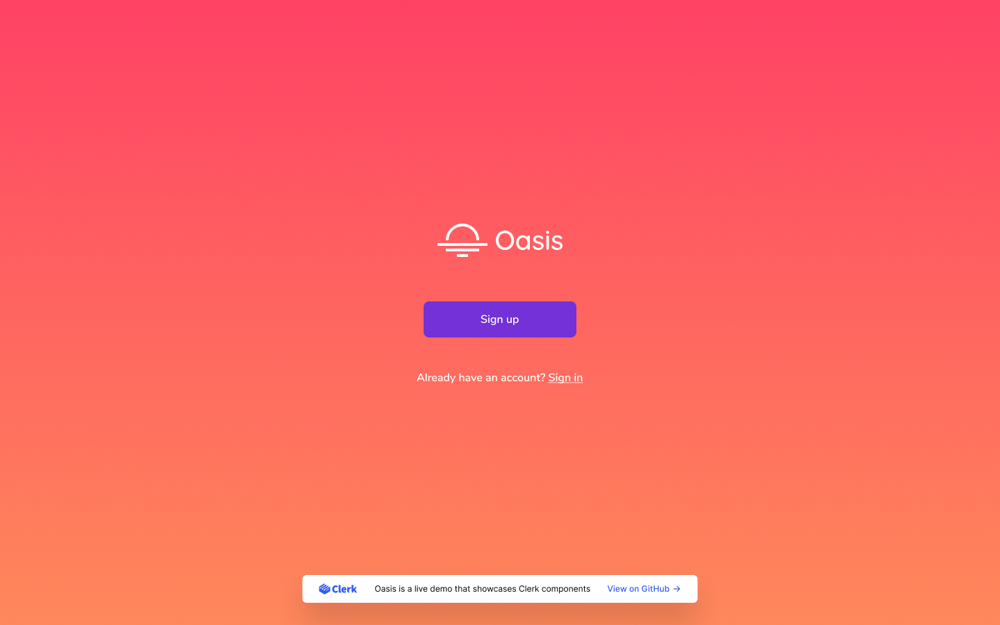

# Clerk Oasis Starter



This Next.js project demonstrates how to use [@clerk/clerk-nextjs hooks](https://clerk.dev/docs/quickstarts/get-started-with-nextjs?utm_source=github&utm_medium=starters&utm_campaign=oasis) to build a custom sign-up and sign-in wizard with two-factor authentication and user profile attributes.

The custom sign-in flow is implemented in a single component to demonstrate how to use Clerk with minimum effort. On the contrary, the custom sign-up flow has been fully componetized and leverages Clerk frontend state management. We also used [React-hook-form](https://react-hook-form.com) to build our forms.

[](https://open.vscode.dev/clerkinc/clerk-nextjs-examples)

## Live demo

https://nextjs.oasis.clerk.app/

## Getting Started

### Clerk Instance Setup

The Oasis example requires a few Clerk instance settings to be set.

1. You have to enable passwordless authentication using OTP codes as described in the [official documentation](https://clerk.dev/docs/authentication/custom-flows/email-sms-otp).

2. You should request the name of your user under Personal information section.

3. You should require usernames.

### Development Setup

### 1. Setup environment variables

First, you need to set two environment variables for Clerk's SDK. Go to the API Keys page and start by copying the Frontend API key. Then, add it a .env.local file in your application root, with the name `NEXT_PUBLIC_CLERK_FRONTEND_API`:

```bash
# Replace [frontend-api-key] with your actual Frontend API key
echo "NEXT_PUBLIC_CLERK_FRONTEND_API=[frontend-api-key]" >> .env.local
```

Next, go back to the API Keys page and copy the Backend API key. Then, add it in the same .env.local file, with the name `CLERK_API_KEY`:

```bash
# Replace [backend-api-key] with your actual Backend API key
echo "CLERK_API_KEY=[backend-api-key]" >> .env.local

```

### 2. Run the development server

```bash
npm run dev
```

Lastly, open [http://localhost:3000](http://localhost:3000) with your browser.

You can start editing the page by modifying `pages/index.tsx`. The page auto-updates as you edit the file.

## Learn More

To learn more about Next.js, take a look at the following resources:

- [Next.js authentication with Clerk](https://clerk.dev/docs/quickstarts/get-started-with-nextjs) - Add secure, beautiful, and fast authentication to Next.js with Clerk.
- [Next.js Documentation](https://nextjs.org/docs) - learn about Next.js features and API.
- [Learn Next.js](https://nextjs.org/learn) - an interactive Next.js tutorial.

You can check out [the Next.js GitHub repository](https://github.com/vercel/next.js/) - your feedback and contributions are welcome!

## Deploy on Vercel

The easiest way to deploy your Next.js app is to use the [Vercel Platform](https://vercel.com/new?utm_medium=default-template&filter=next.js&utm_source=create-next-app&utm_campaign=create-next-app-readme) from the creators of Next.js.

Check out our [Next.js deployment documentation](https://nextjs.org/docs/deployment) for more details.
