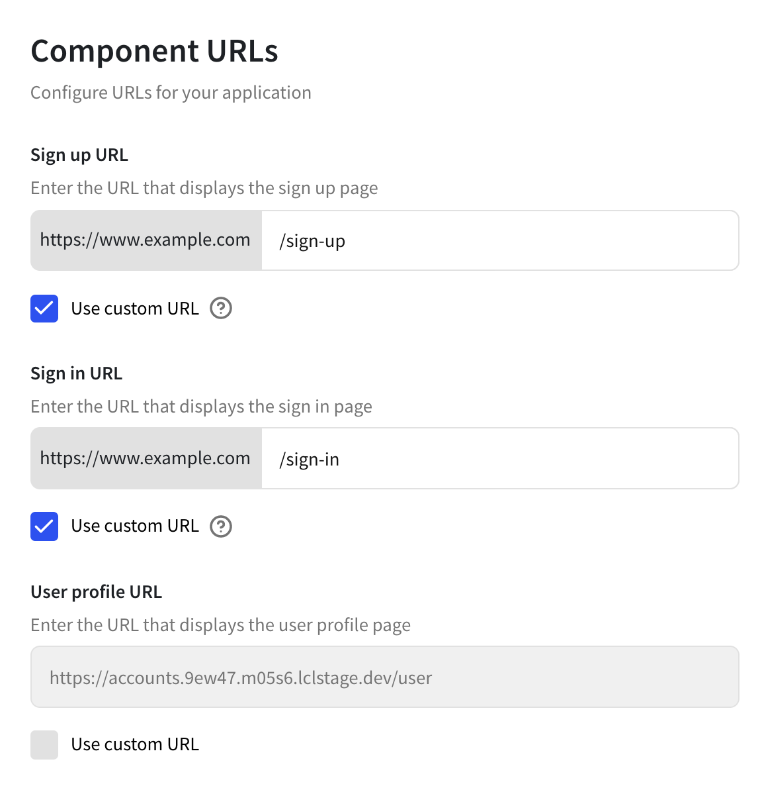

# Clerk Widget Starter


This Next.js project demonstrates how to use [@clerk/clerk-nextjs](https://docs.clerk.dev/get-started/nextjs?utm_source=github&utm_medium=starters&utm_campaign=widget) together with the core ClerkJS SDK methods to build a custom sign-up and sign-in screen with custom user attributes.

The custom sign-in flow is implemented in a single component to demonstrate how to use ClerkJS with minimum effort. On the contrary, the custom sign-up flow has been fully componentized and leverages ClerkJS frontend state management. We also used [React-hook-form](https://react-hook-form.com) to build our forms.

Additionally, the project demonstrates how to synchronize data between your back-end (server) and Clerk.dev. The recommended method for syncing user data is to set up a server endpoint which receives [Clerk webhooks](https://docs.clerk.dev/reference/webhooks) for user related events.

[](https://open.vscode.dev/clerkinc/clerk-nextjs-examples)

## Getting Started

### Clerk Instance Setup

The Widget example requires a few Clerk instance settings to be set. Go to your instance dashboard page under **Settings** → **URL and Redirects** and set `Sign-in` and `Sign-up` urls as shown below:



### Development Setup

1. Follow the instructions at the [getting started guide](https://docs.clerk.dev/get-started/nextjs?utm_source=github&utm_medium=starters&utm_campaign=widget) for Next.js to setup Clerk.

2. Run the development server:

```bash
npm run dev
# or
yarn dev
```

Open [http://localhost:3000](http://localhost:3000) with your browser to see the result.

You can start editing the page by modifying `pages/index.tsx`. The page auto-updates as you edit the file.

## Live demo

https://nextjs.widget.clerk.app/

## Learn More

To learn more about Next.js, take a look at the following resources:

- [Next.js Documentation](https://nextjs.org/docs) - learn about Next.js features and API.
- [Learn Next.js](https://nextjs.org/learn) - an interactive Next.js tutorial.

You can check out [the Next.js GitHub repository](https://github.com/vercel/next.js/) - your feedback and contributions are welcome!

## Deploy on Vercel

The easiest way to deploy your Next.js app is to use the [Vercel Platform](https://vercel.com/new?utm_medium=default-template&filter=next.js&utm_source=create-next-app&utm_campaign=create-next-app-readme) from the creators of Next.js.

Check out our [Next.js deployment documentation](https://nextjs.org/docs/deployment) for more details.
