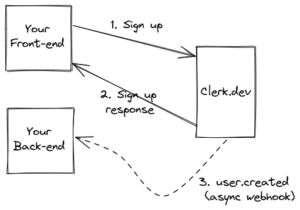
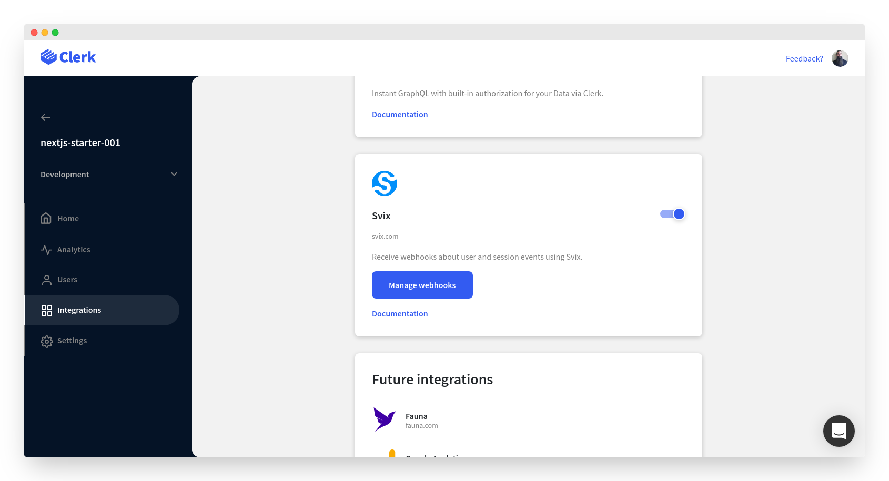

# Webhooks

The project demonstrates how to set up a [Next.js API route](https://nextjs.org/docs/api-routes/introduction) to handle webhook requests coming from Clerk.

In this example, the webhook endpoint listens for user related events on Clerk.dev. It handles the `user.created` and `user.updated` events, so that the app's database is synced with Clerk.

The only thing that's happening here is syncing a basic `users` database table with the webhook incoming data. You can use this example as a starter to add any functionality you need.

## Data syncing

Following a popular pattern for distributed systems syncing, Clerk uses webhooks to notify on important events.

The recommended way to sync your datastore with Clerk is described in the following schema. The example is for signing up a new user, but the idea is the same for any other important event in your app.

In the schema above there are three main steps.

1. A user signs up in your application. Your front-end will ask Clerk to handle the sign up.
2. Clerk replies back with the sign up response. The `SignUp` object and the new `User` object are available through the `Clerk`object in the front-end.
3. Clerk triggers a `user.created` webhook to your configured endpoint. The payload will hold all information regarding the newly created user.

The webhook will be retried until Clerk receives a `200 OK` response from your server.

## Configuring webhooks

Webhooks can be configured through your [Clerk Dashboard](https://dashboard.clerk.dev).

Select your application instance and navigate to _Integrations_. Turn on the Svix integration.

From there, you can set up endpoints to listen for all or specific Clerk events.

In order for this example to work, once you've set up your webhooks integration from the Clerk Dashboard, you need to copy the webhook endpoint's signing secret and set it as the value of the `WEBHOOK_SECRET` environment variable. See the `.env` file included in the example.

## Testing locally

Webhooks are designed to work with public URLs. As such, testing locally requires some additional effort.

This section is about local testing, which is usually done only during development. Once you go to production, you'll need to replace your production public URLs in your webhook configuration.

Testing webhooks locally requires some sort of public server that can tunnel requests to your localhost. Thankfully, there are some services and programs that offer this kind of functionality and they are easy to set up.

The most popular service that provides a public URL to your localhost server is [ngrok](https://ngrok.com/). It's really easy to set up and it offers a free tier with limited usage.

A popular ngrok alternative is [localtunnel](https://github.com/localtunnel/localtunnel). This is an open-source solution that can be installed as an npm package.

## Learn more

To learn more about Clerk webhooks and Svix, the underlying webhook delivery service, take a look at the following links.

- [Clerk webhook documentation](https://clerk.dev/docs/integration/webhooks)
- [Receiving webhooks with Svix](https://docs.svix.com/receiving/introduction)
- [Verifying Svix webhooks](https://docs.svix.com/receiving/verifying-payloads/how)
